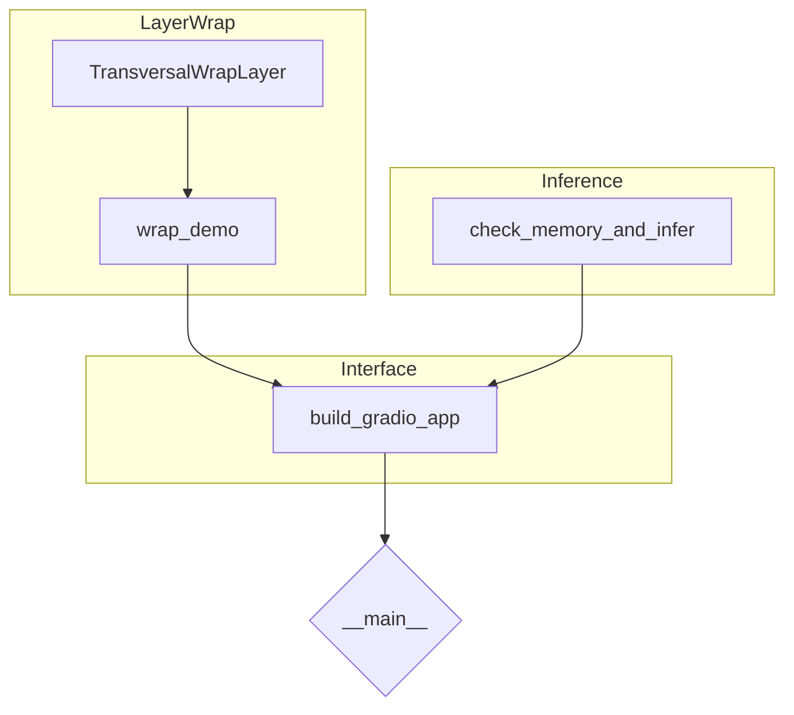

# Program Flow

The following diagram illustrates the high-level flow of `shapeshifter.py` and how each major function interacts. Every "object" represents a distinct set of functionality.

- **`TransversalWrapLayer`** – implements the wrapping logic that expands a tensor by adding its border edges back onto themselves. It is defined at lines 27–52 in `shapeshifter.py`【F:shapeshifter.py†L27-L52】.
- **`wrap_demo`** – generates a dummy tensor, applies the wrap layer, and returns the before/after arrays. See lines 59–76【F:shapeshifter.py†L59-L76】.
- **`check_memory_and_infer`** – verifies available RAM and optionally runs a small T5 model. Refer to lines 83–120【F:shapeshifter.py†L83-L120】.
- **`build_gradio_app`** – constructs the Gradio interface with two tabs: the wrap demo and the inference tool. Implemented at lines 125–185【F:shapeshifter.py†L125-L185】.
- **`__main__` block** – launches the Gradio application if the script is executed directly. See lines 191–194【F:shapeshifter.py†L191-L194】.

The overall program loads required libraries, defines the custom layer, provides demonstration utilities, and offers an optional text-generation example, all accessible via the Gradio interface.
